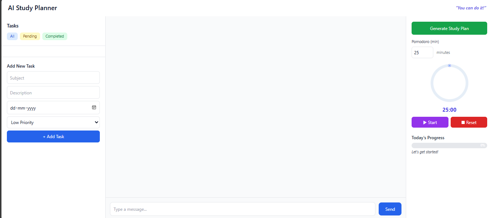

**AI Study Planner**

Designed to help students plan and manage their studies effectively.It combines a task manager,Pomodoro timer,motivational quotes,progress tracking and an AI assistant powered by Google’s Gemini API.The app allows you to create tasks with deadlines and priorities,generate structured study plans..

**Tech Stack**

The frontend uses **HTML** along with **TailwindCSS** for styling and **JavaScript**.On the backend it runs on **Flask (Python)**. Data is stored in a **SQLite database** which is managed through `models.py`.For the AI features..the app integrates **Google’s Gemini API** via the `google-generativeai` library.It also makes use of **dotenv** to handle environment variables securely.. 

